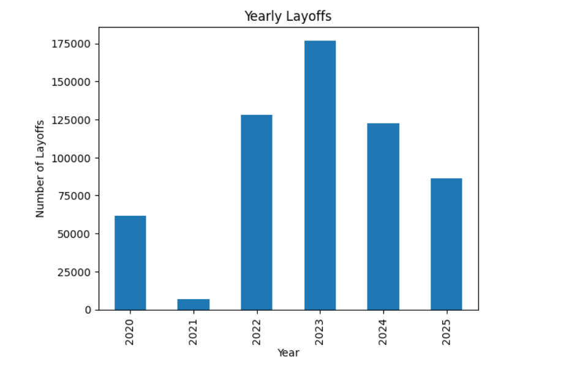
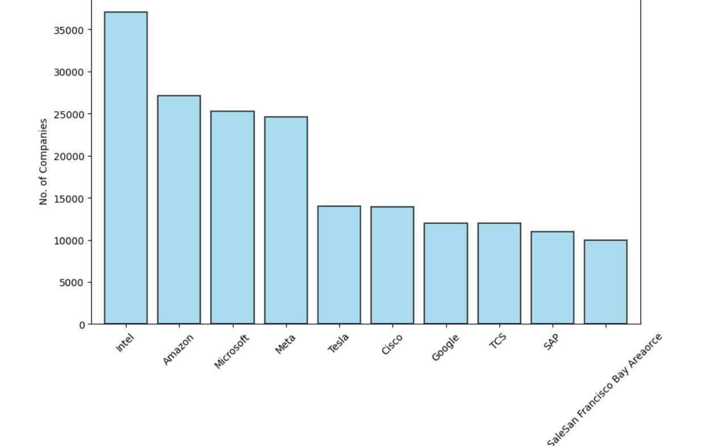
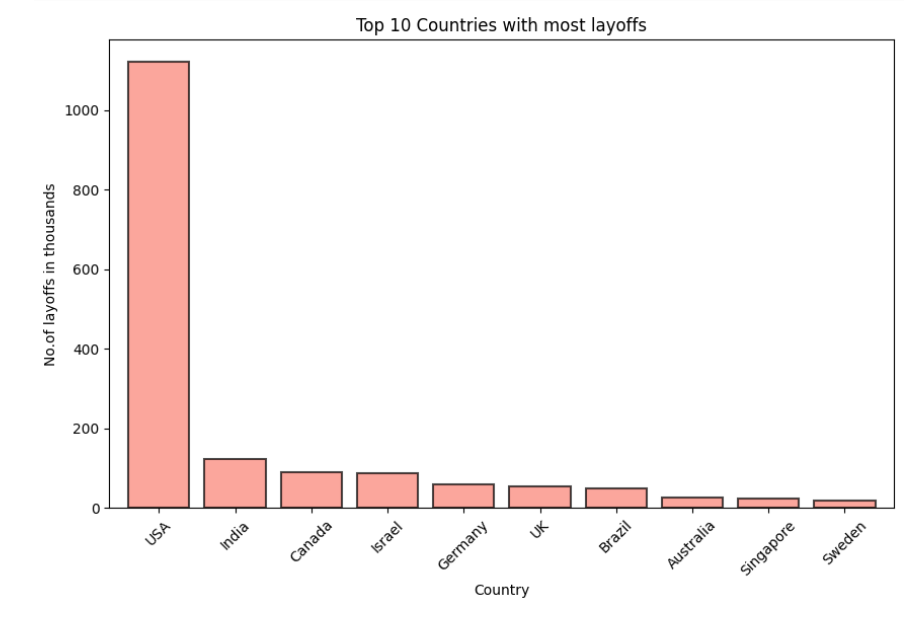
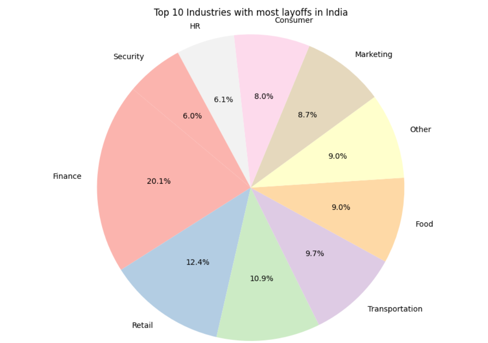
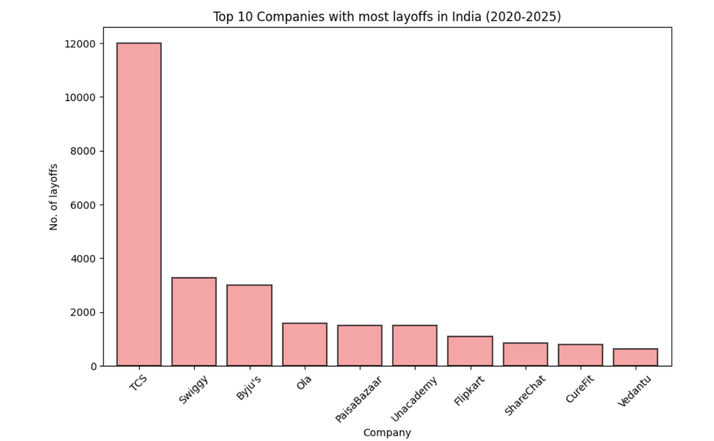
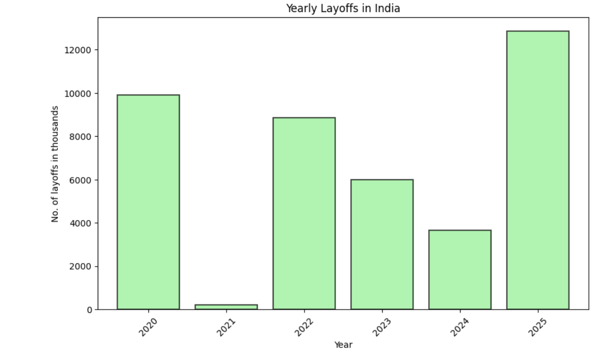
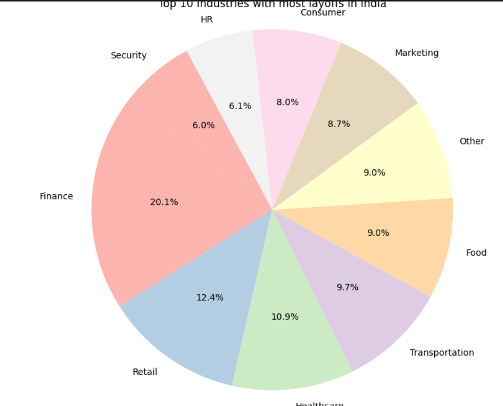
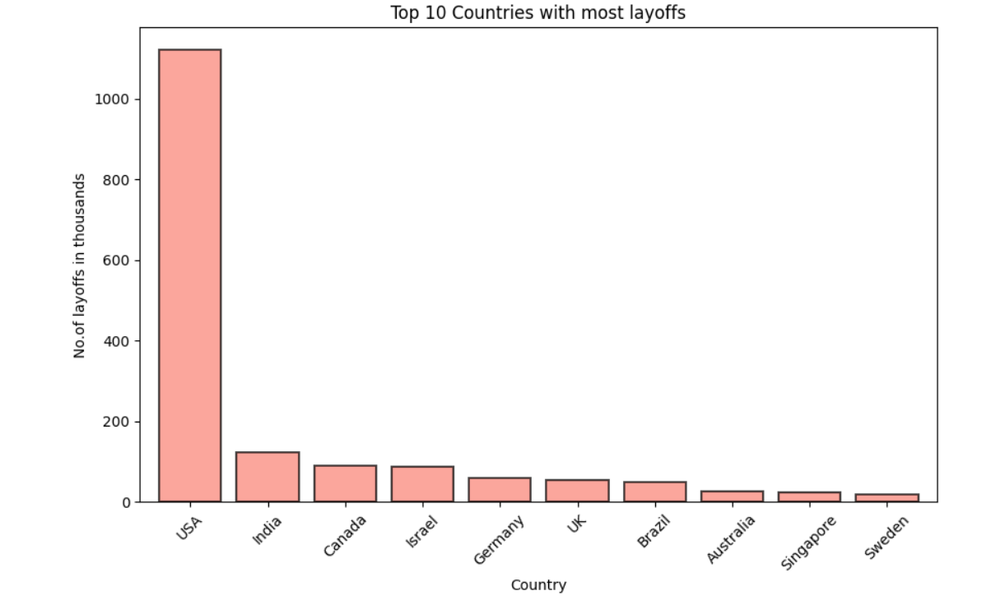
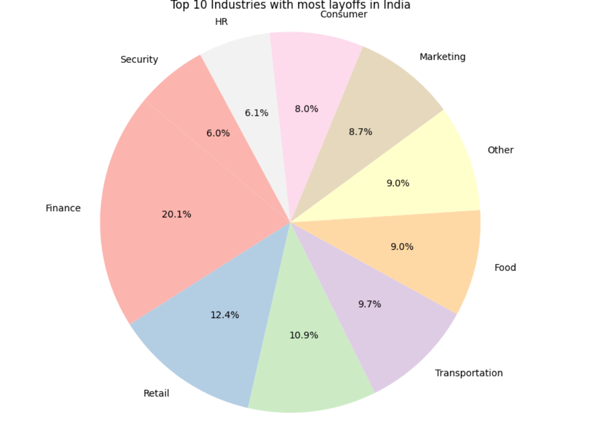

# Recommended Architecture
--------------------------

```
AI-Labor-Market-Intelligence/
│
├── data/
│   ├── raw/
│   ├── processed/
│   ├── external/
│   └── final/
│
├── notebooks/
│   ├── 01_data_collection.ipynb
│   ├── 02_data_cleaning.ipynb
│   ├── 03_eda.ipynb
│   ├── 04_feature_engineering.ipynb
│   ├── 05_forecasting.ipynb
│   ├── 06_nlp_analysis.ipynb
│   └── 07_dashboard_export.ipynb
│
├── src/
│   ├── data/
│   ├── preprocessing/
│   ├── features/
│   ├── models/
│   ├── visualization/
│   └── utils/
│
├── dashboards/
│
├── reports/
│
├── research/
│
├── requirements.txt
│
└── README.md

```

# PROJECT VISION
# -----------------

Final Goal

Build:

“AI Labor Market Intelligence Platform”

A full-stack analytics + forecasting system that answers:

1. How AI is changing jobs
2. Which jobs are dying
3. Which skills are rising
4. Why layoffs happen
5. Engineering employability crisis
6. Future workforce predictions


# STEP 2 — DEFINE CORE DATASETS
# ----------------------------------

This is your MOST IMPORTANT step.

Your project quality depends on data quality.

CORE DATASETS YOU NEED

# Dataset 1 — Tech Layoffs

* Main source:

layoffs.fyi dataset

Contains:

```

company
layoffs
date
industry
stage
country

```

# Dataset 2 — Job Demand Dataset

* Need:

```

job postings
skill requirements
salaries
role names

```

* Sources:

```

LinkedIn jobs
Indeed
Kaggle job datasets

```


# Dataset 3 — Engineering Graduate Data

* Need:

```

graduates/year
employability %
placement %
branch-wise data

```

* Sources:

```

AISHE reports
AICTE
Statista
government datasets

```


# Dataset 4 — Unemployment Data

* Need:

```

yearly unemployment
youth unemployment
graduate unemployment

```

* Sources:

```

World Bank
ILO
CMIE India

```


# Dataset 5 — AI Adoption Dataset

* Need:

```
company AI spending
AI hiring
AI investment
automation adoption

```

# Data Collection Job Trends Analysis
-------------------------------------

# AI Job Market Analysis – Tech Layoffs Insights
------------------------------------------------

## 📌 Overview
---------------

This project analyzes a global tech layoffs dataset to identify trends and patterns in layoffs across companies, industries, countries, and years.

Using Python, Pandas, and Matplotlib, the project performs:
- Data cleaning
- Missing value handling
- Exploratory Data Analysis (EDA)
- Data visualization

The analysis helps understand how layoffs have impacted the tech industry globally and specifically in India.

---

# 📂 Dataset Information
-------------------------

### Dataset Used
`Cleaned_tech_layoffs.csv`

### Dataset Size
- Rows: 1745
- Columns: 18

# ⚙️ Technologies Used

- Python
- Pandas
- NumPy
- Matplotlib
- Jupyter Notebook

---

# 📊 Exploratory Data Analysis (EDA)

## 1️⃣ Yearly Layoffs Trend

Analyzed total layoffs year-wise.

### Visualization
- Bar chart of yearly layoffs


### Insight
- Layoffs increased rapidly after 2022.

---

## 2️⃣ Top Companies With Highest Layoffs

### Top Companies
| Company | Layoffs |
|---|---|
| Intel | 37022 |
| Amazon | 27150 |
| Microsoft | 25305 |
| Meta | 24600 |
| Tesla | 14000 |

### Visualization
- Top 10 companies bar chart


---

## 3️⃣ Country-wise Layoffs Analysis

### Most Affected Countries
- USA
- India
- Canada
- Israel
- Germany

### Visualization
- Country-wise bar chart



---

## 4️⃣ Industry-wise Layoffs

### Most Affected Industries
- Consumer
- Retail
- Transportation
- Travel
- Finance

### Visualization
- Pie chart of top industries
 company layoffs in india most top 10
  
  



---

# 🇮🇳 India-Specific Analysis

The project separately analyzes layoffs trends in India.

## Analysis Included
- Industry-wise layoffs
- Yearly layoffs trend
- Top companies with layoffs

### Visualizations
- bar charts
 
 
- pie charts
 


---

# 📈 Visualizations Included


The project generates:
- Yearly layoffs graphs

- Company-wise layoffs charts

- Country-wise comparison charts

- Industry distribution pie charts

- India-specific analysis chart


---

# 📌 Key Insights

- USA recorded the highest layoffs globally.
- India ranked among the top affected countries.
- Post-IPO companies experienced major layoffs.
- Consumer and Retail industries were highly impacted.
- Layoffs peaked during 2022–2024.

---

# 🚀 How to Run This Project

## 1️⃣ Clone Repository

```bash
git clone https://github.com/your-username/AI-Job-Market-Analysis.git
```

---

## 2️⃣ Install Required Libraries

```bash
pip install pandas numpy matplotlib
```

---

## 3️⃣ Run Jupyter Notebook

```bash
jupyter notebook
```

---

# 📁 Project Structure

```bash
AI-Job-Market-Analysis/
│
├── data/
│   └── raw/
│       └── layoffs dataset/
│           └── Cleaned_tech_layoffs.csv
│
├── notebooks/
│   └── layoffs_analysis.ipynb
│
├── images/
│
├── README.md
│
└── requirements.txt
```

---


